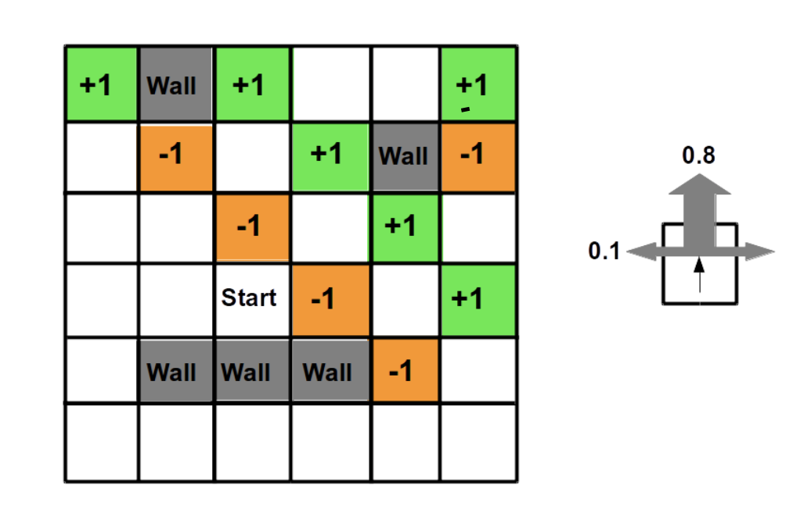

# Grid World program for the Markov Decision Process

## 1. Project Overview

Grid  World  is  a  2D  rectangular  grid  of  size  Ny,  Nx  (in  our  case,  Nx=6  and  Ny=6grid) with an agent starting off at one grid square. The agent will take actions in theform of directional steps (up, down, left, or right) to move to an adjacent grid square within the environment of the rectangular grid.

Referring to the diagram above, there are 4 types of grid squares: 
1)  Green  square:  Landing  on  this  square  results  in  the  agent  receiving  a  positive 1 reward
2) Brown Square: Landing on this square results in the agent receiving a negative 1 reward
3) White Square: Landing on this square has no effect on the agent in terms of reward
4) Gray Square/Wall: This square serves as an obstacle - the agent cannot move into this grid square

## Executing the Program
The program can be accessed by executing the python file main.py. The relevant functions for maze creation, executing the optimal policy algorithmsand generating visualisations from the algorithms are imported and invoked from thiscentral location.

## Source Code Functionality  
`main.py`
> Entry point of program. This python file is used to execute the different functions implemented in the program to initialise environments, execute value/policy iteration algorithms and generate visualisations.

`Main.py`
> Represents the maze environment with respective conditions such as action probability values, in each state as shown in the environment.

`constants.py`
> Responsible for the storage of all constant variables used in the program such as Discount Factor, Epsilon value, Reward Values, etc.

`bonus_functions.py`
> Responsible for the generation of more complicated mazes and functions to extract time and number of iterations taken for convergence with varying maze configurations.

`valueiteration.py`
> Responsible for the implementation of the value iteration algorithm.

`policyiteration.py`
> Responsible for the implementation of the policy iteration algorithm.

`print_utilities.py`
> Responsible for printing the final utility of all states to visualise the states of a policy.

`grid_visualisation.py`
> Responsible for the generation of grid Graphical User Interfaces (GUIs) using the Tkinter python library to visualise the optimal policy and final utility values of all states in our grid environment.

`plot_utility_graph.py`
> Responsible for the generation of graphs to visualise the trend of utility estimates as a function of number of iterations. 

## Authors

* Glendon Thaiw ([GitHub](https://github.com/glendont) | [LinkedIn](https://www.linkedin.com/in/glendonthaiw/))

## References

This project references the following libraries to put together the solution:

- [Tkinter](https://docs.python.org/3/library/tkinter.html)

